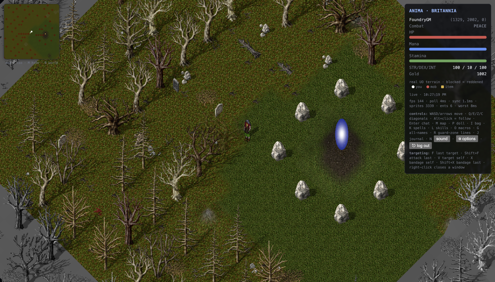
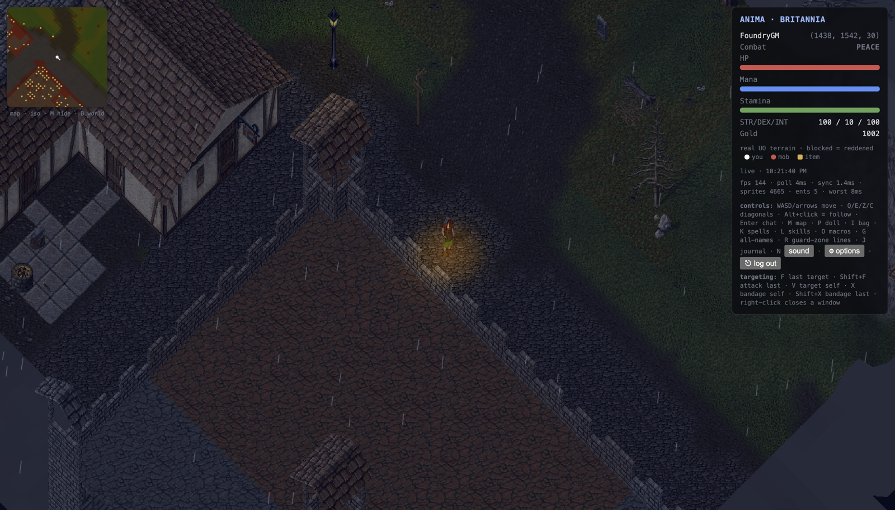

# Anima — macOS·Windows용 울티마 온라인 클라이언트

**Anima(아니마)**는 Rust로 처음부터 만든 오픈소스 **울티마 온라인(Ultima Online, UO) 클라이언트**입니다. 사람이 직접 플레이하는 데스크톱 앱과 AI 플레이어가 같은 게임 코어를 사용합니다.

**[최신 버전 다운로드](https://github.com/hulryung-uo/anima-client/releases/latest)** · [소개 사이트](https://www.uotavern.com/client/ko/) · [English](README.md) · [설치 안내](docs/GETTING_STARTED.md) · [버그 제보](https://github.com/hulryung-uo/anima-client/issues)

## 다운로드와 시작하기

| 운영체제 | v0.6.0 설치 파일 |
|---|---|
| macOS — Apple Silicon, M 시리즈 | [DMG 다운로드](https://github.com/hulryung-uo/anima-client/releases/download/v0.6.0/Anima_0.6.0_aarch64.dmg) · 서명 및 공증 완료 |
| Windows — x64 | [설치 프로그램 다운로드](https://github.com/hulryung-uo/anima-client/releases/download/v0.6.0/Anima_0.6.0_x64-setup.exe) |

1. 운영체제에 맞는 파일을 설치하고 Anima를 실행합니다.
2. 직접 준비한 UO 게임 데이터 폴더를 선택합니다. `.mul` / `.uop` 파일은 앱에 포함되어 있지 않습니다.
3. 접속할 서버의 주소·포트와 본인 계정을 입력합니다.
4. 서버에서 제공한 캐릭터를 선택하거나, 빈 슬롯에 새 캐릭터를 만들어 접속합니다.

현재 배포되는 Mac 앱은 **Apple Silicon 전용**입니다. Intel Mac용은 소스에서 별도로 빌드해야 합니다. Anima는 서버를 제공하지 않으며, 실제 플레이 검증은 ServUO 환경을 중심으로 이루어졌습니다. 모든 서버와의 호환성을 보장하지는 않습니다.

## 어떤 기능이 있나요?

- 실제 UO 데이터로 그리는 지형·건물·캐릭터와 애니메이션
- 페이퍼돌, 가방, 상점, 주문서, 책, 파티, 거래 창
- 월드맵, 이름 표시, 체력바, 매크로와 마우스 바인딩
- 밤과 던전의 어둠, 횃불과 가로등, 효과음과 음악
- 같은 코어로 동작하는 브라우저 렌더러와 AI 에이전트 인터페이스

## AI 플레이어를 만들고 싶다면

`anima-core`는 화면 없이 UO 프로토콜, 월드 상태, 이동과 경로 탐색을 처리합니다. AI는 패킷을 해석하는 대신 `Observation`을 받아 `Action`을 돌려줍니다. Rust 내부 에이전트와 외부 Python 에이전트가 같은 계약을 사용합니다.

- [아키텍처와 개발 안내](docs/DESIGN.md)
- [JSON 인터페이스](crates/anima-contract-json)
- [Anima2 소개](https://www.uotavern.com/anima/) — 빠른 판단·스킬 루프와 선택형 LLM을 결합한 Python AI 플레이어
- [Anima2 저장소와 실행 안내](https://github.com/hulryung-uo/anima2)
- [검증 내역과 호환성 기록](docs/CLASSICUO_GAPS.md)

브라우저 모드는 개발자용 설정이 필요합니다. 서버와 연결하는 릴레이와 게임 데이터 제공 프로세스가 필요하며, 공개 체험 서버는 제공하지 않습니다. 자동 플레이 허용 여부는 접속할 서버의 규칙을 확인하세요.

## 프로젝트에 참여하기

설치·접속 결과와 재현 가능한 버그 제보가 도움이 됩니다. [이슈](https://github.com/hulryung-uo/anima-client/issues)에 운영체제, Anima 버전, 서버 종류, 재현 순서를 적어 주세요. 비밀번호와 개인 계정 정보는 올리지 마세요. 코드 기여는 [기여 안내](CONTRIBUTING.md)를 참고하세요.

코드는 MIT 또는 Apache-2.0 라이선스입니다. UO 게임 데이터는 포함되지 않으며, 이용자가 직접 준비해야 합니다. Anima는 독립 커뮤니티 프로젝트입니다.
